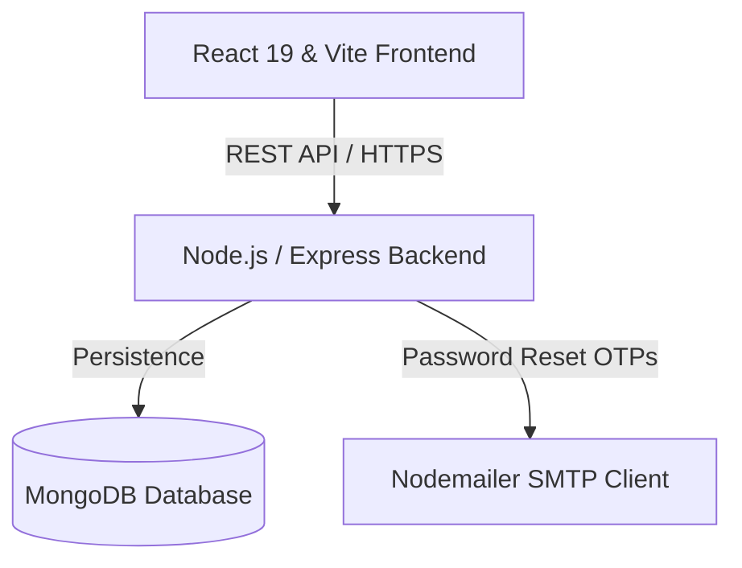

# 💼 Dayflow - HRMS & Attendance Management System

A premium, full-stack, multi-role human resource management and employee attendance platform. The platform allows employees to manage daily attendance clock actions (check-in, break, check-out), apply for leaves, view payroll cost details, and configure bank account info. It also features comprehensive management boards for HR Managers and system administrators to organize departments, analyze work records, schedule holidays, and manage candidate recruitment pipelines.

---

## 🏗️ Architecture Overview

The system follows a decoupled client-server architecture with secure authentication, real-time metrics, and database persistence:



---

## 🌟 Key Features

### 👤 Multi-Role Dashboard & Access Control
The application provides distinct layouts, navigations, and actions tailored specifically to three active roles:
*   **System Admin:** High-level platform administration, system synchronization, and global organization metrics.
*   **HR Manager:** 
    *   **Employee Onboarding:** Register new employees and assign unique IDs.
    *   **Recruitment Pipeline:** Create open job positions, manage candidates, and convert hired candidates into employee user profiles instantly.
    *   **Leave Management:** Approve or reject leave applications submitted by staff members.
    *   **Interactive Reports:** Query real-time attendance, leaves, and payroll costing logs with customizable filters and download Excel/CSV sheets.
*   **Employee (Staff):** 
    *   **Attendance Logger:** Log daily clock actions (Check-In, Go on Break, Resume, Check-Out) with auto-tracked timezone alignment.
    *   **Leave Portal:** Check active leave statuses and apply for new requests with duration dates.
    *   **Personal Profile & Settings:** Update contact numbers, security passwords, and bank details (IFSC, Account Number, Branch).

### ⏰ Timezone-Aware Attendance Tracking
*   Uses local machine formatting (`toLocaleDateString('en-CA')`) instead of generic UTC transitions.
*   Ensures early-morning and late-night check-ins register correctly under the local date, preventing incorrect date shifts.

### 📊 Employee Work Hours Analytics
*   Renders a full-width weekly tracking chart mapping actual logged attendance hours from Monday to Friday.
*   Overlays default baseline work hours for incomplete days to keep chart points fully aligned.

### 📅 Interactive Holiday Calendar Redesign
*   Displays corporate events and national holidays as highlighted inline badges directly inside a full-width grid calendar.
*   Guarantees state synchronization on component mounting, ensuring details remain consistent during reloads.

### ✉️ Nodemailer OTP Password Recovery
*   Generates a secure, random 6-digit verification code with a strict 3-minute expiration window.
*   Dispatches recovery emails using Nodemailer SMTP, displaying success/failure feedback popups dynamically to users.

---

## 🛠️ Technology Stack

### Frontend
*   **Core Framework:** React 19 & Vite
*   **Styling & Design:** TailwindCSS v4, Vanilla CSS Custom Tokens, and Lucide React Icons
*   **Data Visualization:** Recharts (Responsive Weekly Charts)
*   **State Management:** React Context API (AuthContext, ThemeContext)
*   **Routing:** React Router v6

### Backend
*   **Core Framework:** Express.js & Node.js
*   **Database ORM:** Mongoose & MongoDB
*   **Security:** JSON Web Token (JWT) stateless authorization & Bcrypt password hashing
*   **Mail Client:** Nodemailer SMTP Integration

---

## 📂 Directory Structure

```text
Dayflow-HRMS/
├── backend/                    # Node.js / Express API Service
│   ├── config/                 # Database connection config
│   ├── middleware/             # JWT auth & route protection filters
│   ├── models/                 # Mongoose schemas (User, Attendance, Job, Candidate, etc.)
│   ├── routes/                 # REST API Router Endpoints
│   ├── scripts/                # Database seed scripts
│   ├── server.js               # Express application entry point
│   ├── package.json            # Backend package configuration
│   └── .env                    # Environment variables configuration
└── frontend/                   # React Vite Client
    ├── src/
    │   ├── components/         # Shared components (Header, Sidebar, ProtectedRoute)
    │   ├── context/            # AuthContext provider and reducers
    │   ├── layouts/            # Role-based workspace frame layouts
    │   ├── pages/              # Role-specific dashboard views & Settings
    │   ├── utils/              # API Client wrappers
    │   ├── App.tsx             # Application router mount
    │   ├── index.css           # Global theme tokens and styles
    │   └── main.tsx            # Client entry point
    ├── package.json            # Frontend package configuration
    └── vite.config.ts          # Vite compilation setup
```

---

## 🚀 Setup & Installation

### Prerequisites
*   [Node.js](https://nodejs.org/) (v18 or higher)
*   [MongoDB Community Edition](https://www.mongodb.com/try/download/community) running locally on port `27017`

### 1. Database Setup
1. Start your local MongoDB server:
   ```bash
   mongod
   ```
2. The backend server will automatically connect to MongoDB and initialize the required database collections.

### 2. Backend Configuration
1. Navigate to the `backend/` directory:
   ```bash
   cd backend
   ```
2. Create or verify the `.env` environment variables file:
   ```env
   PORT=5000
   MONGODB_URI=mongodb://localhost:27017/dayflow-hrms
   JWT_SECRET=your_jwt_secret_key_here
   
   # SMTP mail config for OTP resets (Gmail Example)
   EMAIL_HOST=smtp.gmail.com
   EMAIL_PORT=585
   EMAIL_USER=your-email@gmail.com
   EMAIL_PASS=your-gmail-app-password
   ```
3. Install dependencies:
   ```bash
   npm install
   ```
4. Seed your database with demo roles (Admin, HR Manager, Employee) and initial metrics:
   ```bash
   npm run db:seed
   ```
5. Launch the backend server:
   ```bash
   npm run dev
   ```
   The backend server runs on `http://localhost:5000`.

### 3. Frontend Setup
1. Navigate to the `frontend/` directory:
   ```bash
   cd ../frontend
   ```
2. Install dependencies:
   ```bash
   npm install
   ```
3. Run the client application in development mode:
   ```bash
   npm run dev
   ```
   The frontend application will boot up at `http://localhost:5173`.
